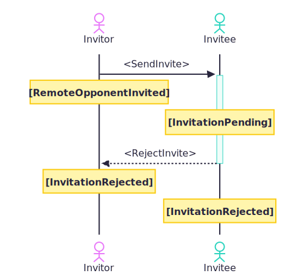
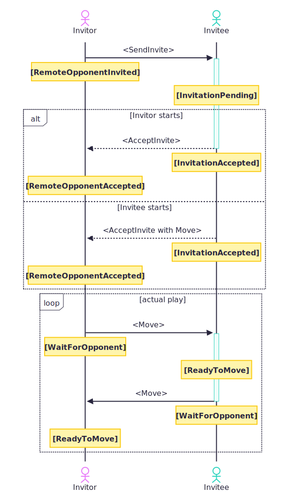

# HyleX

A Hyle (Entropy) board game clone

--- Still in development, Multiplayer mode not playable at the moment ! ---

Download the early alpha here for testing: https://hyleX.jepfa.de/hylex.apk

## Implementation

### Multiplayer

#### Invitation

State model from the perspective of an invitor (initiator of an invitation):

State model from the perspective of the invitee (receiver of an invitation):

### Play state model

State model flow if an invitation gets rejected:

State model flow if an invitation gets accepted:

