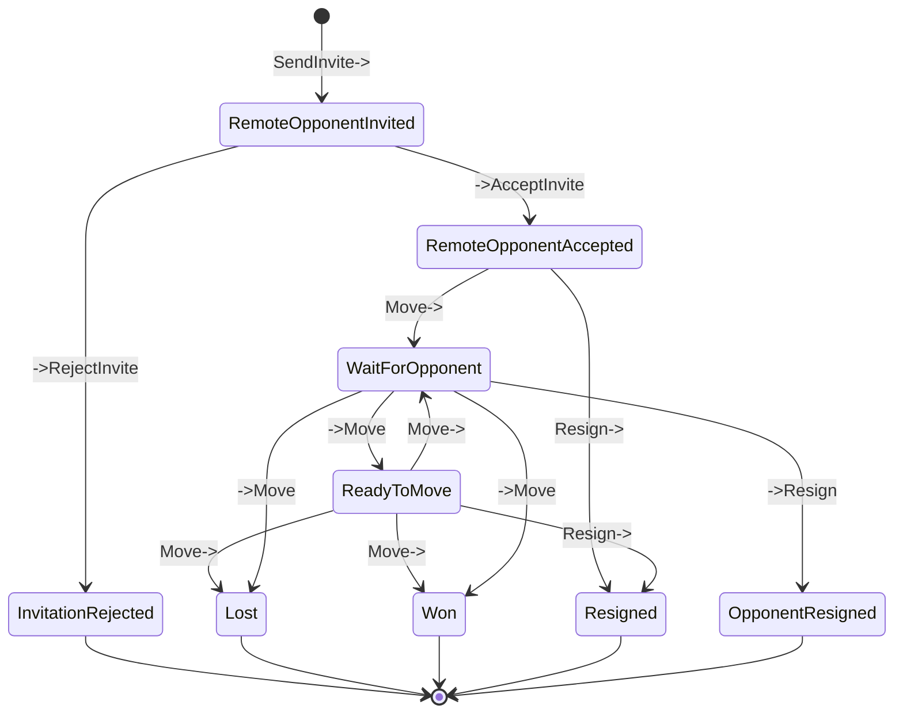
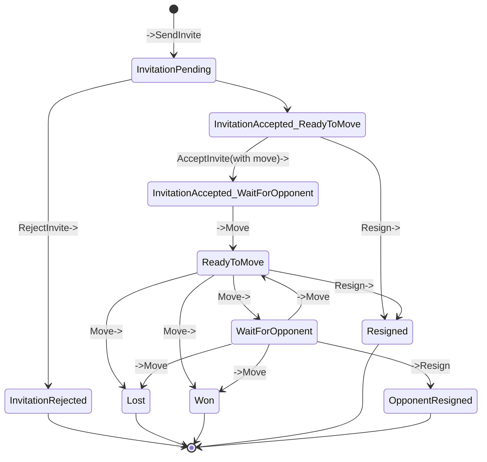
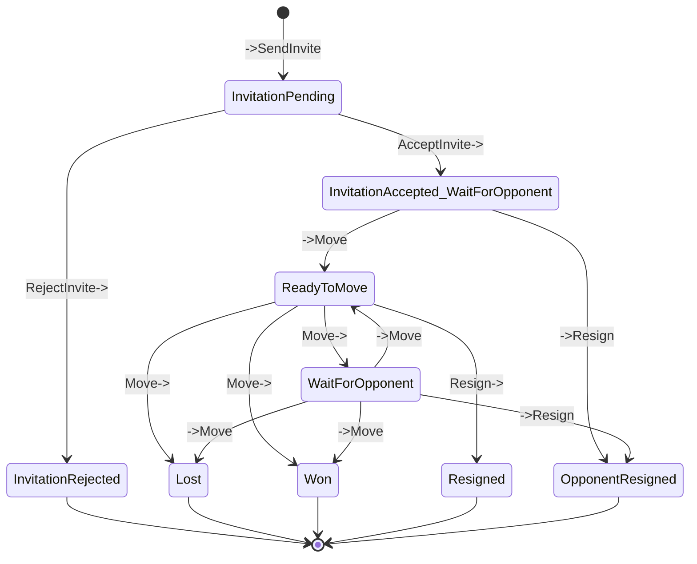
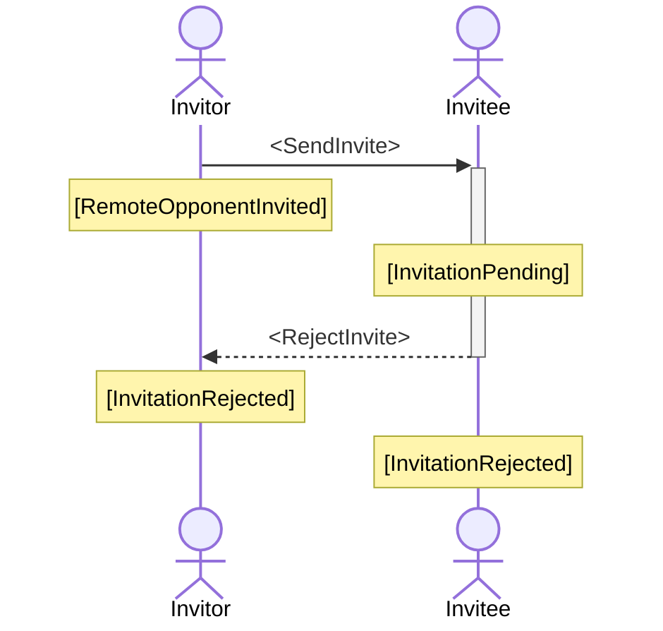
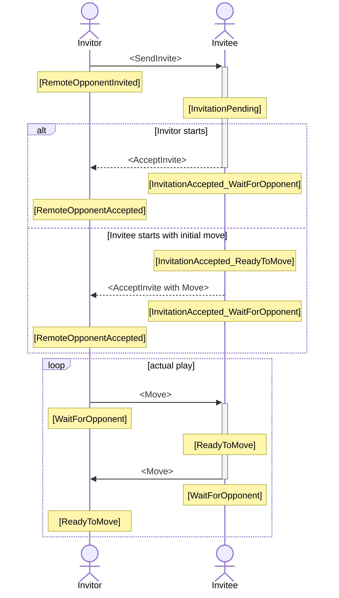

# HyleX

A Hyle (Entropy) board game clone

--- Still in development ---

Single player against AI is playable.

Multiplayer is playable too but not error free so far ! ---

Download the latest test version here for testing: https://hyleX.jepfa.de/hylex.apk

## Implementation

### Multiplayer

#### Invitation state transitions

How to read:

Boxes are PlayStates, arrows are allowed transitions. Text on arrows are Operations triggering the transitions.

`->Operation` means an incoming/received operation from a message.
`Operation->` means an outgoing/sent operation from a message.

##### State model from the perspective of an invitor (initiator of an invitation):

##### State model from the perspective of the invitee (receiver of an invitation):

###### Invitee has to perform first move:

###### Invitee has to await first move from invitor:

#### Play state transitions

How to read:

Boxes are PlayStates, arrows are allowed transitions, indicating the direction. Text on arrows are Operations triggering the transitions.

##### Sequence flow if an invitation gets rejected:

##### Sequence flow if an invitation gets accepted:

